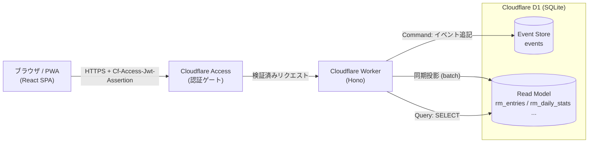

# logly バックエンド設計書（Cloudflare Workers / DDD + CQRS + Event Sourcing）

> 対象: 個人開発のライフログアプリ `logly` のバックエンド
> スタイル: ドメイン駆動設計（DDD）＋ 厳密な CQRS ＋ イベントソーシング
> 実行基盤: Cloudflare Workers + D1 / フレームワーク: Hono
> 認証: Cloudflare Access に委譲（利用者は開発者本人 1 人のみ）

---

## 1. 概要 / 目的 / スコープ

### 1.1 目的
現状の `logly` はフロントエンド（React + Vite + PWA）のみで、記録データは
`src/lib/data.ts` の静的モックで動いている。本設計書は、ライフログを**永続化・
同期**するためのバックエンドを Cloudflare Workers 上に構築するための設計を定める。

### 1.2 設計方針
- **永続化**: Cloudflare D1（SQLite）。
- **設計スタイル**: DDD ＋ 厳密な CQRS ＋ イベントソーシング。
  個人 1 人用としては明確にオーバースペックだが、**監査可能性・時系列の自然な表現・
  読み取り最適化・学習価値**を目的に意図的に採用する（§2.3 にトレードオフを明記）。
- **フレームワーク**: Hono。
- **認証**: Cloudflare Access に委譲。アプリ側は独自認証を持たない（§8）。
- **利用者**: 開発者本人 1 人のみ（マルチテナント不要）。

### 1.3 非機能要件
| 項目 | 方針 |
|---|---|
| 運用コスト | Workers + D1 の無料/低額枠に収める。常時起動サーバを持たない |
| レイテンシ | エッジ実行。読み取りは投影済みの読み取りモデルを直接参照し最小化 |
| 整合性 | フロントの既存データ形状（`Entry` 等）と JSON を一致させる |
| 監査性 | すべての変更をイベントとして追記保存し、履歴を再生可能にする |
| 移植性 | ドメイン層は Cloudflare 依存ゼロ（純 TypeScript） |

### 1.4 スコープ
- **対象**: ライフログ記録（Entry）の作成・編集・削除、日別取得、統計取得、カテゴリ取得。
- **対象外（将来拡張・§12）**: AI 自動整形（`AIModal` 相当）、カテゴリ編集 UI、
  リマインダー、複数ユーザー対応、非同期プロジェクション（Queues）。

---

## 2. アーキテクチャ全体像

### 2.1 構成図



### 2.2 技術スタック

| レイヤ | 採用 | 用途 |
|---|---|---|
| 言語 | TypeScript | 全体 |
| HTTP | Hono | ルーティング・ミドルウェア |
| 永続化 | Cloudflare D1 | Event Store ＋ Read Model |
| 入力検証 | Zod | コマンド/クエリの境界バリデーション |
| ID | ULID | 時系列ソート可能な集約 ID |
| テスト | Vitest + `@cloudflare/vitest-pool-workers` | ユニット/結合 |
| デプロイ | Wrangler | Worker / D1 マイグレーション |

### 2.3 なぜ CQRS + Event Sourcing か（採用理由とトレードオフ）

**採用理由**
- ライフログは本質的に「時刻ごとの出来事の追記」であり、イベントストリームと相性が良い。
- 「いつ何を記録/修正したか」という履歴がそのまま監査ログになる。
- 読み取り（日別一覧・カレンダードット・週月年統計）は形が多様で、
  書き込みモデルと分離（CQRS）すると各々を最適化できる。

**トレードオフ（正直な評価）**
- 1 人用 CRUD には実装・運用が明確に過剰。コード量と概念的負荷が増える。
- 「イベント追記 → 投影 → 読み取り」の整合管理が必要（本設計では**同期投影**で
  単純化し、結果整合の遅延を実質ゼロにする。§6.2）。
- スキーマ変更時はイベントのバージョニングとプロジェクション再構築が必要（§6.4）。

→ 本設計では「厳密さを保ちつつ、1 人用に許される単純化（同期投影・単一アクター）」を
採用してバランスを取る。

---

## 3. DDD レイヤ設計とディレクトリ構成

### 3.1 レイヤと依存方向

```
Interface(HTTP)  ──▶  Application  ──▶  Domain
       │                   │              ▲
       └───────────────────┴── Infrastructure（Domain のインターフェースを実装）
```

- 依存は常に内向き。**Domain は外部（Cloudflare/D1/Hono）に一切依存しない**。
- `EventStore` / 読み取り用 DAO のインターフェースは Domain / Application 側で定義し、
  Infrastructure（D1）が実装する（依存性逆転）。

| レイヤ | 責務 | Cloudflare 依存 |
|---|---|---|
| Domain | 集約・値オブジェクト・ドメインイベント・不変条件 | なし |
| Application | コマンド/クエリ ハンドラ、プロジェクション、ポート定義 | なし |
| Infrastructure | D1 EventStore、Read Model DAO、マイグレーション | あり |
| Interface(HTTP) | Hono ルート、DTO 変換、認証ミドルウェア | あり |

### 3.2 ディレクトリ構成（実装時の指針）

```
worker/
  src/
    domain/
      entry/
        Entry.ts            # 集約ルート（イベントから再構築）
        events.ts           # EntryLogged / EntryEdited / EntryDeleted
        values.ts           # EntryId / OccurredAt / Category / MetaItem / Title / Note
      shared/
        AggregateRoot.ts    # 基底クラス（apply/raise/uncommittedEvents）
        DomainEvent.ts      # イベント基底型
        EventStore.ts       # ポート（インターフェース）
    application/
      commands/
        CreateEntry.ts      # コマンド + ハンドラ
        EditEntry.ts
        DeleteEntry.ts
      queries/
        ListEntriesByDay.ts
        ListEntriesByRange.ts
        GetStats.ts
        GetCategories.ts
      projections/
        EntryProjection.ts  # イベント → rm_entries / rm_daily_stats へ投影
        ReadModelStore.ts   # 読み取りモデル更新ポート
    infrastructure/
      d1/
        D1EventStore.ts     # EventStore 実装
        D1ReadModelStore.ts # 投影書き込み
        D1QueryDao.ts       # クエリ用 SELECT
        migrations/         # 0001_init.sql 等
    interface/
      http/
        router.ts           # Hono アプリ
        middleware/access.ts# Cloudflare Access JWT 検証
        dto.ts              # Zod スキーマ + DTO マッピング
    index.ts                # composition root（Env 束ね）
  wrangler.toml
```

---

## 4. ドメインモデル（書き込み側 / Write Model）

### 4.1 ユビキタス言語

| 用語 | 意味 | フロント対応 |
|---|---|---|
| Entry（ログ記録） | ある時刻に起きた出来事 1 件。集約ルート | `Entry`（types.ts） |
| Category | 記録の分類。固定 9 種 | `CATEGORIES`（data.ts） |
| MetaItem | 付帯情報（金額・所要時間・場所・人数 等） | `MetaItem` |
| OccurredAt | 出来事が起きた日時 | `Entry.time` ＋ 日付 |

### 4.2 集約: `Entry`

- **集約ルート**: `Entry`。同一性は `EntryId`（ULID）。
- **集約境界**: Entry 単位で小さく保つ。統計は集約に含めない（読み取りモデルで算出）。
- **不変条件**:
  - `title` は必須・空不可。
  - `category` は既定集合（§4.4）のいずれか。
  - `occurredAt` は妥当な日時。
  - 削除済み Entry は以降のコマンドを受け付けない。

### 4.3 値オブジェクト

| VO | 制約 |
|---|---|
| `EntryId` | ULID 文字列。生成時のみ採番 |
| `OccurredAt` | ISO8601。日付（`YYYY-MM-DD`）と時刻（`HH:mm`）を導出可能 |
| `Category` | 固定 enum（§4.4） |
| `Title` | 1〜120 文字、トリム後非空 |
| `Note` | 任意、0〜2000 文字 |
| `MetaItem` | `{ icon: string; text: string }`、0〜N 個 |

### 4.4 Category（固定 enum）

`src/lib/data.ts` の `CATEGORIES` に対応。当面はコード上の固定値とし、編集機能は将来拡張。

```
work | food | drink | ex | move | sleep | diary | money | other
```

各カテゴリの表示属性（label / icon / color）はフロントと共有する参照データとして
`GET /api/categories` で返す（§7.2）。

### 4.5 ドメインイベント

集約は内部状態を直接変更せず、**ドメインイベントの適用**で状態遷移する。

| イベント | 発生契機 | ペイロード |
|---|---|---|
| `EntryLogged` | 新規作成 | `entryId, occurredAt, category, title, note?, meta[]` |
| `EntryEdited` | 編集 | 変更後の `occurredAt, category, title, note?, meta[]` |
| `EntryDeleted` | 削除 | `entryId`（論理削除。投影側で読み取りモデルから除去） |

イベント共通項目: `aggregateId` / `aggregateType="Entry"` / `version`（集約内連番）/
`occurredAt`（業務上の発生時刻）/ `recordedAt`（記録時刻）。

### 4.6 集約の振る舞い（イベントソーシング）

```ts
// domain/shared/AggregateRoot.ts（抜粋・概念コード）
export abstract class AggregateRoot<E extends DomainEvent> {
  private _version = 0
  private _uncommitted: E[] = []

  get version() { return this._version }
  get uncommittedEvents(): readonly E[] { return this._uncommitted }
  markCommitted() { this._uncommitted = [] }

  protected raise(event: E) {        // 新しい変更
    this.apply(event)
    this._uncommitted.push(event)
  }
  protected replay(event: E) {       // 履歴からの再構築
    this.apply(event)
    this._version++
  }
  protected abstract apply(event: E): void
}
```

```ts
// domain/entry/Entry.ts（抜粋・概念コード）
export class Entry extends AggregateRoot<EntryEvent> {
  private constructor(public readonly id: EntryId) { super() }

  static log(input: LogInput): Entry {              // CreateEntry が呼ぶ
    const e = new Entry(input.id)
    e.raise({ type: 'EntryLogged', ...validate(input) })
    return e
  }

  static fromHistory(id: EntryId, events: EntryEvent[]): Entry {
    const e = new Entry(id)
    for (const ev of events) e.replay(ev)           // リプレイで再構築
    return e
  }

  edit(input: EditInput) {
    this.ensureNotDeleted()
    this.raise({ type: 'EntryEdited', ...validate(input) })
  }
  delete() {
    this.ensureNotDeleted()
    this.raise({ type: 'EntryDeleted', entryId: this.id })
  }

  protected apply(ev: EntryEvent) { /* 状態遷移のみ。副作用なし */ }
}
```

- **再構築**: `fromHistory()` がイベント列を `replay` して現在状態を得る。
- **楽観ロック**: コマンド処理時に「再構築時の version」を期待値として
  Event Store へ追記（§5.3）。

---

## 5. CQRS — コマンド側（Write）

### 5.1 Event Store（D1）スキーマ

```sql
-- migrations/0001_init.sql（Event Store）
CREATE TABLE events (
  sequence       INTEGER PRIMARY KEY AUTOINCREMENT, -- グローバル追記順
  aggregate_id   TEXT    NOT NULL,
  aggregate_type TEXT    NOT NULL,                   -- 'Entry'
  version        INTEGER NOT NULL,                   -- 集約内バージョン(1,2,3..)
  event_type     TEXT    NOT NULL,                   -- 'EntryLogged' 等
  payload        TEXT    NOT NULL,                   -- JSON
  occurred_at    TEXT    NOT NULL,                   -- ISO8601（業務時刻）
  recorded_at    TEXT    NOT NULL,                   -- ISO8601（記録時刻）
  UNIQUE (aggregate_id, version)                     -- 楽観ロック
);
CREATE INDEX idx_events_aggregate ON events (aggregate_id, version);
```

- **追記専用（イミュータブル）**。UPDATE / DELETE は行わない。
  Entry の更新・削除も「新しいイベントの追記」で表現する。
- `UNIQUE(aggregate_id, version)` により、同一バージョンの二重追記（競合）は失敗する。

### 5.2 コマンド

| コマンド | 入力 |
|---|---|
| `CreateEntryCommand` | `occurredAt, category, title, note?, meta[]` |
| `EditEntryCommand` | `entryId, expectedVersion, occurredAt, category, title, note?, meta[]` |
| `DeleteEntryCommand` | `entryId, expectedVersion` |

### 5.3 コマンドハンドラの流れ

```
1. 入力を Zod で検証（Interface 層で実施し、Application へは検証済み値を渡す）
2. EventStore.load(entryId) で過去イベントを取得
3. Entry.fromHistory(events) で集約を再構築（編集/削除時）
4. 集約メソッド（log/edit/delete）でビジネスルール検証 → イベント raise
5. EventStore.append(entryId, expectedVersion, uncommittedEvents)
   - D1 batch() で「イベント追記」と「読み取りモデル投影」を 1 トランザクションに束ねる
6. version 競合（UNIQUE 違反）時は 409 Conflict を返す
```

```ts
// application/commands/CreateEntry.ts（抜粋・概念コード）
export class CreateEntryHandler {
  constructor(private store: EventStore, private projection: EntryProjection) {}
  async handle(cmd: CreateEntryCommand): Promise<{ id: string }> {
    const entry = Entry.log({ id: EntryId.next(), ...cmd })
    await this.store.append(entry, this.projection) // 追記+投影を batch で
    return { id: entry.id.value }
  }
}
```

### 5.4 トランザクション境界（D1 の制約）

- D1 は対話的トランザクションを持たないため、`db.batch([...])` で複数ステートメントを
  **原子的に**実行する。`EventStore.append` 内で「events への INSERT」と
  「読み取りモデルへの UPSERT/DELETE」を 1 つの batch にまとめる（同期投影・§6.2）。
- 競合検出は `UNIQUE(aggregate_id, version)` に依存し、違反時は batch 全体が失敗する。

---

## 6. CQRS — クエリ側（Read）/ プロジェクション

### 6.1 読み取りモデル（D1 スキーマ）

イベントから投影された、クエリ最適化済みのテーブル群。**書き込みモデルとは別物**。

```sql
-- 日別一覧用（フラット化）
CREATE TABLE rm_entries (
  id          TEXT PRIMARY KEY,
  occurred_at TEXT NOT NULL,
  date        TEXT NOT NULL,          -- 'YYYY-MM-DD'（検索キー）
  category    TEXT NOT NULL,
  title       TEXT NOT NULL,
  note        TEXT,
  meta        TEXT NOT NULL DEFAULT '[]' -- JSON: MetaItem[]
);
CREATE INDEX idx_rm_entries_date ON rm_entries (date);

-- 日次×カテゴリ集計（統計・カレンダードット用）
CREATE TABLE rm_daily_category (
  date     TEXT NOT NULL,
  category TEXT NOT NULL,
  count    INTEGER NOT NULL DEFAULT 0,
  PRIMARY KEY (date, category)
);
```

> 週月年の統計（`STAT_BARS` / `CAT_BREAK` / `SUMMARY`）と、カレンダードット
> （`CAL_DOTS`）は `rm_daily_category` を範囲集計して算出する。集計が重くなれば
> `rm_weekly_*` 等の追加投影を将来検討（§12）。

### 6.2 プロジェクション（同期投影）

- 各ドメインイベントを受け、読み取りモデルを更新する。
  - `EntryLogged` → `rm_entries` INSERT、`rm_daily_category` の該当 (date,category) を +1
  - `EntryEdited` → `rm_entries` UPDATE、日付/カテゴリ変更時は旧 -1 / 新 +1
  - `EntryDeleted` → `rm_entries` DELETE、`rm_daily_category` -1
- **同期投影を採用**: コマンド処理と同一リクエスト内で、D1 `batch()` により
  イベント追記と投影更新を原子的に行う。1 人用ゆえ書き込み頻度は低く、
  **結果整合の遅延は実質ゼロ**で問題ない。非同期投影（Queues）は将来拡張。

### 6.3 クエリハンドラ

- 読み取りモデルを直接 SELECT する。**ドメイン層・集約を経由しない**（CQRS の肝）。

| クエリ | 取得元 | 用途（フロント） |
|---|---|---|
| `ListEntriesByDay(date)` | `rm_entries WHERE date=?` | ホーム日別一覧 |
| `ListEntriesByRange(from,to)` | `rm_entries WHERE date BETWEEN` | 期間表示 |
| `GetStats(range=w\|m\|y)` | `rm_daily_category` 範囲集計 | 統計画面・カレンダードット |
| `GetCategories()` | 固定参照データ | カテゴリ一覧 |

### 6.4 プロジェクション再構築（リビルド）

- 読み取りモデルのスキーマ変更やバグ修正時は、`rm_*` を TRUNCATE して
  `events` を `sequence` 昇順に全リプレイし投影し直す（Event Sourcing の利点）。
- 手順は管理用エンドポイント or Wrangler スクリプトで提供（運用は §10）。

---

## 7. HTTP インターフェース（API 設計 / Hono）

### 7.1 ルーティング構成（概念コード）

```ts
// interface/http/router.ts（抜粋）
const app = new Hono<{ Bindings: Env; Variables: { actor: string } }>()

app.use('/api/*', accessMiddleware)          // Cloudflare Access JWT 検証（§8）

// --- Commands ---
app.post('/api/entries', async (c) => {
  const cmd = CreateEntrySchema.parse(await c.req.json())  // Zod
  const { id } = await createEntry.handle(cmd)
  return c.json({ id }, 201)
})
app.put('/api/entries/:id', /* EditEntry */)
app.delete('/api/entries/:id', /* DeleteEntry */)

// --- Queries ---
app.get('/api/entries', /* ?date= or ?from=&to= */)
app.get('/api/stats', /* ?range=w|m|y */)
app.get('/api/categories', /* 固定参照 */)
app.get('/api/entries/:id/events', /* 監査用イベント履歴（任意） */)
```

### 7.2 エンドポイント一覧

| メソッド | パス | 種別 | 説明 |
|---|---|---|---|
| POST | `/api/entries` | Command | ログ記録を作成 → `201 { id }` |
| PUT | `/api/entries/:id` | Command | 記録を編集（`expectedVersion` 必須） |
| DELETE | `/api/entries/:id` | Command | 記録を削除（`expectedVersion` 必須） |
| GET | `/api/entries?date=YYYY-MM-DD` | Query | 日別一覧 |
| GET | `/api/entries?from=&to=` | Query | 期間一覧 |
| GET | `/api/stats?range=w\|m\|y` | Query | 統計（`STAT_RANGES` に対応） |
| GET | `/api/categories` | Query | 固定カテゴリ参照 |
| GET | `/api/entries/:id/events` | Query | 監査用イベント履歴（任意） |

### 7.3 DTO（既存フロント型との整合）

レスポンス JSON はフロントの `src/lib/types.ts` の `Entry` / `MetaItem` /
`CategoryItem` と一致させる。

```jsonc
// GET /api/entries?date=2026-06-28 のレスポンス例
[
  {
    "id": "01J...ULID",
    "time": "07:15",                    // OccurredAt から HH:mm を導出
    "category": "other",                // §4.4 の固定 enum のいずれか
    "icon": "more_horiz",               // カテゴリ参照から付与
    "color": "#a1a1aa",
    "title": "起床、コーヒー1杯",
    "note": "よく眠れた。8時間20分。",
    "meta": [{ "icon": "local_cafe", "text": "ドリップ" }]
  }
]
```

> 注: フロントの `Entry` は `icon`/`color` を保持するが、これらはカテゴリ由来の
> 表示属性。バックエンドは `category` を正とし、`icon`/`color` は
> `GET /api/categories` の参照を used して付与する（DTO 変換層で結合）。

### 7.4 入力検証とエラー規約

- すべてのコマンド入力は **Zod** で境界検証（Interface 層）。
- エラーレスポンスは統一形:

```jsonc
{ "error": { "code": "VALIDATION_FAILED", "message": "title は必須です" } }
```

| 状況 | ステータス | code |
|---|---|---|
| 入力不正 | 400 | `VALIDATION_FAILED` |
| 認証なし/不正 | 401 | `UNAUTHENTICATED` |
| 対象なし | 404 | `NOT_FOUND` |
| 楽観ロック競合（version 不一致） | 409 | `VERSION_CONFLICT` |
| サーバ内部 | 500 | `INTERNAL` |

---

## 8. 認証 / 認可（Cloudflare Access）

### 8.1 方針
- 認証は **Cloudflare Access に完全委譲**。アプリ側はパスワードやセッションを持たない。
- Access が前段でログインを強制し、検証済みリクエストにヘッダ
  `Cf-Access-Jwt-Assertion`（JWT）を付与する。Worker はこの JWT を検証する。

### 8.2 JWT 検証（Hono ミドルウェア）

```ts
// interface/http/middleware/access.ts（抜粋・概念コード）
export const accessMiddleware: MiddlewareHandler = async (c, next) => {
  const token = c.req.header('Cf-Access-Jwt-Assertion')
  if (!token) return c.json({ error: { code: 'UNAUTHENTICATED' } }, 401)

  // team domain の公開鍵で署名・aud・iss を検証
  const certsUrl = `https://${c.env.ACCESS_TEAM_DOMAIN}/cdn-cgi/access/certs`
  const payload = await verifyAccessJwt(token, {
    jwksUrl: certsUrl,
    audience: c.env.ACCESS_AUD,                 // Application Audience(AUD) タグ
  })
  if (payload.email !== c.env.ALLOWED_EMAIL)    // 許可は 1 件に固定
    return c.json({ error: { code: 'UNAUTHENTICATED' } }, 401)

  c.set('actor', payload.email)
  await next()
}
```

検証項目:
1. 署名（`/cdn-cgi/access/certs` の JWKS）
2. `aud`（Access アプリの Application Audience タグ）
3. 発行者（team domain）
4. `email` が許可 1 件（`ALLOWED_EMAIL`）と一致

### 8.3 認可
- 1 人用のためユーザーテーブルは持たない。認可は「**Access を通過した ＝ 唯一の所有者**」のみ。
- イベントの `actor` も単一固定（`ALLOWED_EMAIL`）でよい。将来複数ユーザー化する場合に
  備え、イベントに `actor` を記録しておく余地は残す。

### 8.4 ローカル開発
- ローカルでは Access が前段に存在しないため、`ENV=dev` 時は認証ミドルウェアを
  バイパスし固定 actor を用いる（本番では必ず無効）。Wrangler の `--var` /
  `.dev.vars` で切り替える。

---

## 9. フロントエンド配信方式: SPA か SSR か（メリット/デメリット）

### 9.1 前提
現状は Vite + React の **SPA**（PWA: `index.html` + `public/manifest.webmanifest`）。
Cloudflare では「SPA を Pages で静的配信」「SSR を Worker（Hono JSX / React SSR 等）で
配信」のいずれも可能。本バックエンドは API として独立しているため、どちらとも組める。

### 9.2 比較

| 観点 | SPA（現状維持） | SSR（Hono で配信） |
|---|---|---|
| 既存資産 | ◎ そのまま流用 | △ 移行コストあり |
| PWA / オフライン | ◎ Service Worker と好相性 | △ キャッシュ/ハイドレーション設計が複雑化 |
| 初期表示 / SEO | △ 初回 JS ロード後に描画（個人用途で影響小） | ◎ 即時・SEO 有利 |
| バックエンド責務 | ◎ 純 API に集中、CQRS 境界が明快 | △ 描画責務が混入し Worker が肥大 |
| 配信 / キャッシュ | ◎ 静的をエッジキャッシュ | ○ リクエスト毎レンダリング |
| 運用 | ◎ 最小 | △ レンダリング経路の保守が増える |

### 9.3 推奨
本ユースケース（**1 人用・PWA・ログイン必須・Access 認証**）では、
**SPA を維持し、バックエンドは純粋な API として分離する**構成を推奨する。

- ログイン必須アプリのため SEO の価値がほぼ無い。
- PWA / オフライン体験は SPA + Service Worker が最も素直。
- CQRS の API 境界（コマンド/クエリ）が綺麗に保て、Worker の責務が肥大しない。
- 運用が最小で個人開発に適する。

SSR は「公開ページや初期表示速度が重要になった場合」の将来選択肢として残す。

### 9.4 配信トポロジ
- フロント: Cloudflare Pages（静的 SPA）。
- API: Cloudflare Worker（本設計）。
- 関係: 同一ゾーンのサブパス（例 `app.example.com` + `/api/*` を Worker ルート）か、
  サブドメイン分離（`api.example.com`）。サブドメイン分離時は CORS を許可
  オリジン 1 件に固定。両者とも Cloudflare Access 配下に置く。

---

## 10. 設定 / デプロイ

### 10.1 wrangler 設定（例）

```toml
# wrangler.toml
name = "logly-api"
main = "src/index.ts"
compatibility_date = "2026-06-01"

[[d1_databases]]
binding = "DB"
database_name = "logly"
database_id = "<your-d1-id>"

[vars]
ACCESS_TEAM_DOMAIN = "<your-team>.cloudflareaccess.com"
ACCESS_AUD = "<application-audience-tag>"
ALLOWED_EMAIL = "aise0605@example.com"   # 自分の email のみ許可
```

### 10.2 マイグレーション / リビルド運用
- スキーマ: `wrangler d1 migrations apply logly`。
- 読み取りモデル再構築（§6.4）: 管理スクリプトで `rm_*` を初期化し、
  `events` を `sequence` 昇順に全リプレイして投影し直す。

### 10.3 Access 設定要点
- Access アプリケーションを作成し、保護対象に API（および Pages）を指定。
- ポリシー: 許可を**自分の email 1 件のみ**に限定。
- Worker の `ACCESS_AUD` を当該アプリの Application Audience タグに一致させる。

---

## 11. テスト方針

| 対象 | 種別 | 内容 |
|---|---|---|
| Domain（集約・イベント適用・リプレイ） | ユニット | `fromHistory` の再構築、不変条件、楽観ロック |
| Application（コマンド/クエリ/プロジェクション） | ユニット | EventStore/ReadModel をモックし振る舞い検証 |
| Infrastructure / HTTP | 結合 | `@cloudflare/vitest-pool-workers` で実 D1 に対し<br/>「イベント追記 → 同期投影 → クエリ」の一連を検証 |
| 認証ミドルウェア | ユニット | JWT 検証（署名/aud/iss/email）の合否 |

重点シナリオ:
- 作成 → 日別取得で 1 件返る。
- 編集（日付変更）→ 旧日付から消え新日付に出る、統計の増減が正しい。
- 削除 → 一覧/統計から消える、`events` には削除イベントが残る。
- version 不一致の編集 → 409。

---

## 12. 将来拡張（スコープ外）

- **AI 自動整形**（`AIModal` 相当）: 自然文 → 構造化 Entry。外部 LLM 連携の
  境界をアプリケーション層のユースケースとして追加（コマンド発行前の変換）。
- **カテゴリ編集**: 固定 enum を集約化（`Category` 集約）。
- **リマインダー**: Cron Triggers + 通知。
- **複数ユーザー対応**: イベント/読み取りモデルに `owner` を追加し Access の email で分離。
- **非同期プロジェクション**: 書き込み量増加時に Cloudflare Queues で投影を分離。

---

## 付録 A: フロント読み取りニーズ → 読み取りモデル対応表

| フロント（data.ts） | 画面 | 供給クエリ / テーブル |
|---|---|---|
| `ENTRIES` | ホーム日別一覧 | `ListEntriesByDay` / `rm_entries` |
| `DAYSTRIP` | 日付ストリップ | クライアント生成（日付のみ） |
| `CAL_DOTS` | カレンダードット | `GetStats` / `rm_daily_category` |
| `STAT_BARS` | 統計バー | `GetStats(range)` / `rm_daily_category` |
| `CAT_BREAK` | カテゴリ内訳 | `GetStats(range)` / `rm_daily_category` |
| `SUMMARY` | サマリ | `GetStats(range)` / `rm_daily_category`（+将来 meta 集計） |
| `CATEGORIES` | カテゴリ参照 | `GetCategories` / 固定参照 |
| `STAT_RANGES` | 期間切替 | クエリ引数 `range=w\|m\|y` |
