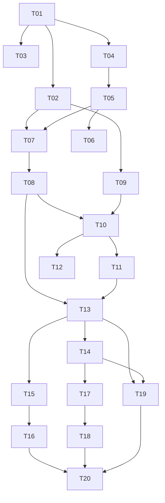

# logly バックエンド 実装ロードマップ（チケット分割）

> 対象設計書: [`docs/design/backend.md`](./backend.md)
> 構成: Cloudflare Workers + D1 / DDD + CQRS + Event Sourcing / Cloudflare Access 認証
> 方針: レイヤ依存方向（内側 → 外側）に沿って直列に進める。各チケットは独立して
> レビュー・マージ可能な粒度を目安にする。

## マイルストーン一覧

| マイルストーン | 目的 | 含むチケット |
|---|---|---|
| M0 基盤セットアップ | 動く土台（雛形・D1・CI） | T01〜T03 |
| M1 ドメイン + ES 基盤 | 集約とイベントソーシング核 | T04〜T06 |
| M2 コマンド側（Write） | Event Store と書き込み | T07〜T08 |
| M3 クエリ側 + 投影（Read） | 読み取りモデルとクエリ | T09〜T12 |
| M4 HTTP API（Hono） | エンドポイントと DTO | T13〜T14 |
| M5 認証（Access） | JWT 検証と運用 | T15〜T16 |
| M6 フロント結合 | SPA を API 接続へ | T17〜T18 |
| M7 仕上げ / デプロイ | 結合テストと本番化 | T19〜T20 |

サイズ目安: **S**＝半日以内 / **M**＝1〜2 日 / **L**＝3 日以上。

---

## M0. 基盤セットアップ

### T01 Worker プロジェクト雛形 〔S〕
- **概要**: `worker/` に Hono + TypeScript + Vitest + `wrangler.toml` の最小構成を作る。
  composition root（`src/index.ts`）と `/api/health` のみ通す。
- **受け入れ基準**:
  - `wrangler dev` で起動し `GET /api/health` が 200 を返す。
  - `vitest` が空テストを含めて緑。
- **依存**: なし
- **設計書参照**: §2, §3.2, §10.1

### T02 D1 とマイグレーション基盤 〔S〕
- **概要**: D1 データベース作成、`wrangler d1 migrations` 運用、`migrations/` ディレクトリ整備。
- **受け入れ基準**:
  - `wrangler.toml` に `DB` バインディングがある。
  - 空マイグレーションが apply でき、ローカル D1 に接続できる。
- **依存**: T01
- **設計書参照**: §5.1, §10.2

### T03 CI（lint / test） 〔S〕
- **概要**: oxlint + vitest をローカル/CI で回す土台を整える。
- **受け入れ基準**:
  - lint・test が CI で実行され、失敗時に赤になる。
- **依存**: T01
- **設計書参照**: §11

---

## M1. ドメイン + Event Sourcing 基盤

### T04 共有カーネル（AggregateRoot / EventStore ポート） 〔M〕
- **概要**: `AggregateRoot`（apply / raise / replay / uncommittedEvents）、`DomainEvent`
  基底型、`EventStore` ポート（インターフェース）、ULID 採番ユーティリティ。
- **受け入れ基準**:
  - `raise` で未コミットイベントが蓄積、`replay` で version が進む。
  - Cloudflare/D1 への依存が無い（純 TypeScript）。
- **依存**: T01
- **設計書参照**: §3.2, §4.6

### T05 Entry 集約 + 値オブジェクト + ドメインイベント 〔M〕
- **概要**: 値オブジェクト（EntryId/OccurredAt/Category/Title/Note/MetaItem）、
  ドメインイベント（EntryLogged/EntryEdited/EntryDeleted）、不変条件を実装。
- **受け入れ基準**:
  - `Entry.log/edit/delete` が対応イベントを raise する。
  - title 必須・category 既定集合・削除後コマンド拒否などの不変条件が効く。
- **依存**: T04
- **設計書参照**: §4

### T06 ドメインユニットテスト 〔S〕
- **概要**: 集約の再構築と不変条件をテストで固定。
- **受け入れ基準**:
  - `fromHistory` のリプレイ再構築、不変条件違反、削除後拒否が検証される。
- **依存**: T05
- **設計書参照**: §11

---

## M2. コマンド側（Write）

### T07 Event Store（D1）実装 〔M〕
- **概要**: `events` テーブルの DDL と `D1EventStore`（load / append）。
  `UNIQUE(aggregate_id, version)` による楽観ロック。
- **受け入れ基準**:
  - イベント追記・集約単位の読み出しができる。
  - 同一 version の二重追記が失敗し競合を検出できる。
- **依存**: T02, T05
- **設計書参照**: §5.1, §5.4

### T08 コマンドハンドラ（Create / Edit / Delete） 〔M〕
- **概要**: 3 コマンドとハンドラ。再構築 → ビジネスルール検証 → イベント追記の流れ。
- **受け入れ基準**:
  - 作成・編集・削除が Event Store に正しいイベント列を残す。
  - `expectedVersion` 不一致で競合エラーになる。
- **依存**: T07
- **設計書参照**: §5.2, §5.3

---

## M3. クエリ側 + プロジェクション（Read）

### T09 読み取りモデルスキーマ 〔S〕
- **概要**: `rm_entries`・`rm_daily_category` の DDL とインデックス。
- **受け入れ基準**:
  - マイグレーションで両テーブルが作成され、`date` にインデックスがある。
- **依存**: T02
- **設計書参照**: §6.1

### T10 同期プロジェクション 〔M〕
- **概要**: 各ドメインイベント → 読み取りモデル更新を、コマンド処理と同一 `batch()` で原子化。
- **受け入れ基準**:
  - Logged/Edited/Deleted で `rm_entries` と `rm_daily_category` が整合更新される。
  - イベント追記と投影が原子的（片方だけ成功しない）。
- **依存**: T08, T09
- **設計書参照**: §5.4, §6.2

### T11 クエリハンドラ 〔M〕
- **概要**: ListEntriesByDay / ListEntriesByRange / GetStats(range) / GetCategories を
  読み取りモデル直 SELECT で実装（ドメイン層を経由しない）。
- **受け入れ基準**:
  - 日別・期間一覧、週月年統計、カテゴリ参照が返る。
- **依存**: T10
- **設計書参照**: §6.3, 付録A

### T12 プロジェクション リビルド 〔S〕
- **概要**: `rm_*` を初期化し `events` を `sequence` 昇順に全リプレイして再構築する手段。
- **受け入れ基準**:
  - リビルド後の読み取りモデルが逐次投影の結果と一致する。
- **依存**: T10
- **設計書参照**: §6.4

---

## M4. HTTP インターフェース（Hono）

### T13 ルーティング + 検証 + エラー規約 〔M〕
- **概要**: Hono ルート（コマンド/クエリ）、Zod 入力検証、統一エラー（400/401/404/409/500）。
- **受け入れ基準**:
  - §7.2 の各エンドポイントが疎通する。
  - 入力不正 400・version 競合 409 が規約どおり返る。
- **依存**: T08, T11
- **設計書参照**: §7.1, §7.4

### T14 DTO 整合（既存フロント型） 〔S〕
- **概要**: レスポンスを `src/lib/types.ts` の `Entry`/`MetaItem`/`CategoryItem` に一致させる
  変換層。`category` を正とし icon/color をカテゴリ参照から付与。
- **受け入れ基準**:
  - レスポンス JSON が既存フロント型でそのまま受けられる。
- **依存**: T13
- **設計書参照**: §7.3, 付録A

---

## M5. 認証（Cloudflare Access）

### T15 JWT 検証ミドルウェア 〔M〕
- **概要**: `Cf-Access-Jwt-Assertion` を JWKS（`/cdn-cgi/access/certs`）で検証する Hono
  ミドルウェア。署名・aud・iss・email 固定をチェック。
- **受け入れ基準**:
  - 正当な JWT のみ通過し、不正/欠如/email 不一致は 401。
- **依存**: T13
- **設計書参照**: §8.1〜§8.3

### T16 dev バイパス + Access 設定手順 〔S〕
- **概要**: ローカル開発時の認証バイパス（`ENV=dev`）と、本番 Access アプリ/ポリシー
  （email 1 件許可）設定手順の整備。
- **受け入れ基準**:
  - ローカルで認証なしに動作し、本番設定手順がドキュメント化される。
- **依存**: T15
- **設計書参照**: §8.4, §10.3

---

## M6. フロント結合

### T17 API クライアント化 〔M〕
- **概要**: フロントの静的 `src/lib/data.ts` 参照を API フェッチへ置換。`src/lib` に
  fetch クライアントを追加し、各画面のデータ取得を接続。
- **受け入れ基準**:
  - ホーム/カレンダー/統計が API データで表示される。
  - 作成/編集/削除が API 経由で反映される。
- **依存**: T14
- **設計書参照**: §7, 付録A

### T18 配信トポロジ + CORS 〔S〕
- **概要**: Pages(SPA) と Worker(API) の関係を確定（サブパス or サブドメイン）、CORS を
  許可オリジン 1 件に固定。SPA 維持方針。
- **受け入れ基準**:
  - フロントから API への CORS が許可オリジンのみで通る。
- **依存**: T17
- **設計書参照**: §9.4, §10

---

## M7. 仕上げ / デプロイ

### T19 結合テスト 〔M〕
- **概要**: `@cloudflare/vitest-pool-workers` で「イベント追記 → 同期投影 → クエリ」一連、
  編集の日付移動、削除、version 競合 409 など重点シナリオを検証。
- **受け入れ基準**:
  - §11 の重点シナリオが結合テストで緑。
- **依存**: T13, T14
- **設計書参照**: §11

### T20 本番デプロイ 〔S〕
- **概要**: Worker デプロイ、D1 本番マイグレーション、Access 本番ポリシー（email 1 件）適用。
- **受け入れ基準**:
  - 本番 URL で Access 認証後に API が動作する。
- **依存**: T16, T18, T19
- **設計書参照**: §10

---

## 将来（バックログ・スコープ外）

- AI 自動整形（自然文 → 構造化 Entry、`AIModal` 相当）
- カテゴリ編集（`Category` 集約化）
- リマインダー（Cron Triggers + 通知）
- 複数ユーザー対応（イベント/読み取りモデルに `owner` 追加）
- 非同期プロジェクション（Cloudflare Queues）

設計書参照: §12

---

## 依存関係グラフ

> 進行は M0 → M7 の概ね直列。M5（認証）は M4 完了後いつでも差し込み可能。
> M3（クエリ/投影）と M2（コマンド）は T08→T10 で接続する。
